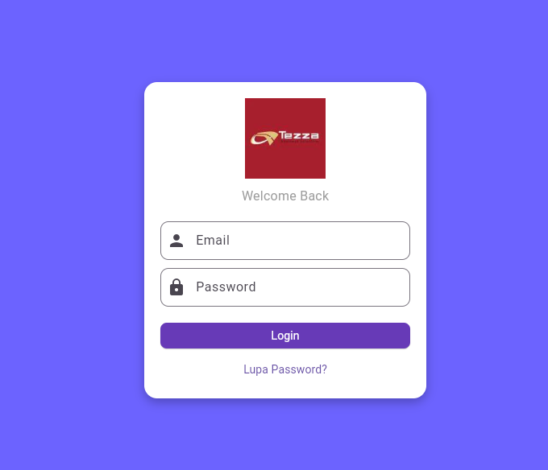
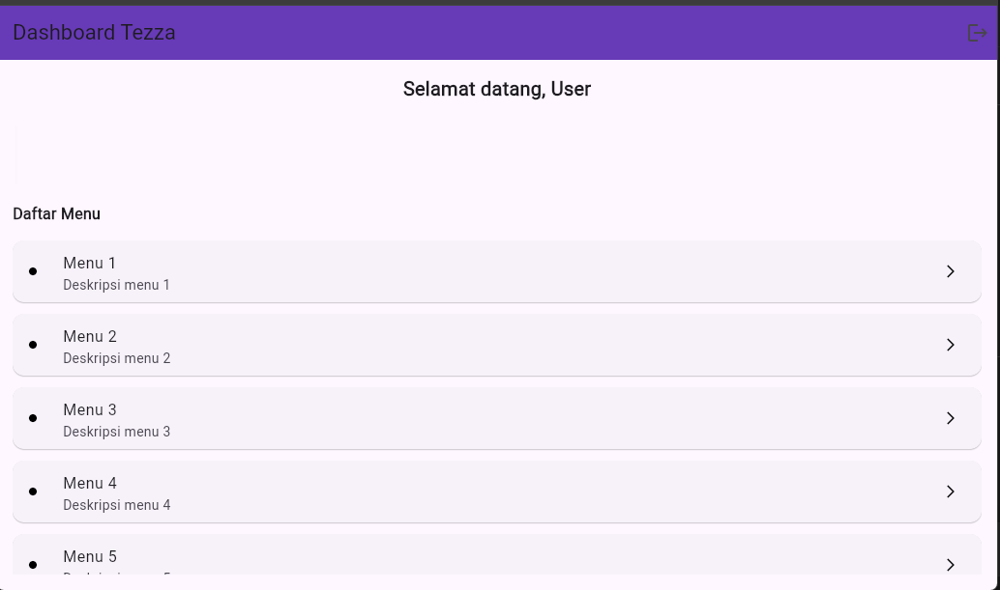
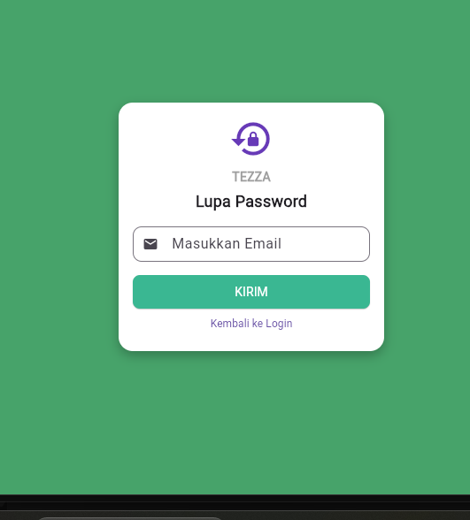

# 📱 Tezza App - Flutter UTS Project

## 📌 Deskripsi Aplikasi
Aplikasi Tezza adalah aplikasi mobile berbasis Flutter Aplikasi Tezza ini dibuat oleh kreator untuk kreator. Fokusnya bikin konten yang estetik dengan tools yang gampang dipake, tanpa ribet Udah jadi andalan banyak content creator top.

---

## ✨ Fitur Aplikasi

- 🔐 Login Page (autentikasi sederhana)
- 🏠 Dashboard Page
  - Menampilkan nama user dari login
  - Card informasi dashboard
  - ListView.builder (10 item menu)
  - Tombol logout
- 🔑 Lupa Password Page
  - Input email
  - Simulasi kirim reset password
- 🔄 Navigasi antar halaman menggunakan Navigator
- 🎨 UI sederhana dengan Flutter Material Design

---
## 🚀 Cara Menjalankan Aplikasi
    Buka VS code
    terminal
    jalankan flutter pub get,flutter run
    jalankan clone https://github.com/valeriatezza/flutter-uts-tezza.git
    jalankan cd flutter-uts-tezza
    
## 📸 Screenshot Aplikasi

### 1. Login Page

### 2. Dashboard Page

### 3. Lupa Password Page

---

